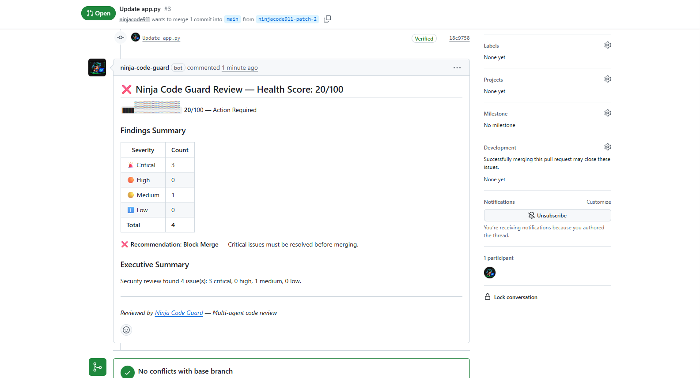
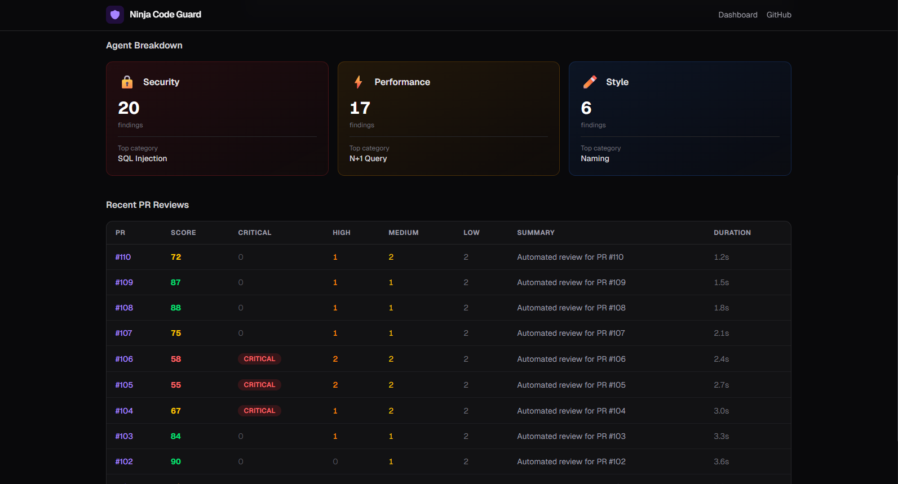

# Ninja Code Guard

> **A multi-agent code review system that reviews GitHub pull requests the way a senior engineering team would.**

Three specialized AI agents — **Security**, **Performance**, and **Style** — analyze your code in parallel using LLM reasoning + static analysis tools, then a **Synthesizer** merges their findings into a single, prioritized, non-overlapping review posted directly to your PR as inline GitHub comments.

**Live API:** [ninjainpjs-ninja-code-guard.hf.space](https://ninjainpjs-ninja-code-guard.hf.space)

---

## Live PR Review

When a pull request is opened, Ninja Code Guard automatically posts a review with a Health Score, severity breakdown, and detailed findings — just like a senior engineer would.



---

## Dashboard

A Next.js dashboard provides real-time visibility into code health across all connected repositories.

### Repository Overview
Monitor all repos at a glance — health scores, total PRs reviewed, and issues found.


### Repo Detail — Health Score Trends
Track code quality over time with Health Score trend charts, agent breakdown cards, and per-PR review history.


### PR Review Table
Drill into individual repos to see every PR reviewed, with severity counts, scores, and review duration.



---

## How It Works

```
PR opened on GitHub
        |
        v
   Webhook received --> HMAC-SHA256 validated
        |
        v
   Redis cache check --> Skip if already reviewed
        |
        v
   Fetch PR data --> Diff + full file contents
        |
        v
   RAG Context --> Embed files -> ChromaDB -> Retrieve related code
        |
        v
   +-------------------------------------------+
   |     3 Agents run IN PARALLEL              |
   |  Security    Performance     Style        |
   |  Bandit+LLM   Radon+LLM    Ruff+LLM      |
   +-------------------+-----------------------+
                       |
                       v
   Synthesizer --> Deduplicate -> Rank -> Score -> Summarize
        |
        v
   Post to GitHub --> Inline comments + Summary with Health Score
```

### The Pipeline in Detail

1. **GitHub fires a webhook** when a PR is opened, updated, or reopened
2. **HMAC-SHA256 validation** ensures the request genuinely came from GitHub (prevents attackers from triggering fake reviews)
3. **Redis cache check** skips PRs that were already reviewed (prevents duplicate reviews when multiple commits are pushed quickly)
4. **GitHub API client** fetches the PR diff, full file contents for changed files, and recent commit history
5. **RAG pipeline** embeds file contents into ChromaDB using sentence-transformers, then retrieves semantically related code chunks as context for agents
6. **Three domain agents run in parallel** via `asyncio.gather()` — total latency is `max(agent_latencies)` not `sum(agent_latencies)`, cutting review time from ~15s to ~5s
7. **Synthesizer agent** deduplicates overlapping findings (e.g., Security and Performance flagging the same line), resolves severity conflicts, ranks by importance, and computes the Health Score
8. **GitHub comment** is posted with inline findings anchored to specific code lines + a summary with the Health Score

---

## What Each Agent Does

| Agent | Role | Static Tools | What It Catches |
|-------|------|-------------|-----------------|
| **Security** | Senior AppSec engineer | Bandit, detect-secrets | SQL injection (CWE-89), command injection (CWE-78), hardcoded secrets (CWE-798), weak cryptography, SSRF, XSS |
| **Performance** | Principal backend engineer | Radon (cyclomatic complexity) | N+1 query patterns, O(n^2) nested loops, blocking I/O in async context, missing caching, inefficient data structures |
| **Style** | Staff engineer (codebase health) | Ruff (Rust-based linter) | Unused imports, dead code, non-descriptive naming, missing error handling, code duplication, magic numbers |
| **Synthesizer** | Engineering manager | Cosine similarity dedup | Deduplication across agents, severity conflict resolution, composite ranking, Health Score (0-100), executive summary |

### Why Both Static Tools AND an LLM?

**Static tools** (Bandit, Radon, Ruff) are fast, deterministic, and catch mechanical patterns — but they can't understand context, intent, or cross-function data flow.

**The LLM** (Llama-3.3-70B via Groq) understands semantics — it can reason about whether user input is sanitized upstream, whether a function needs error handling based on its callers, or whether a naming convention matches the rest of the codebase.

Together they're more accurate than either alone: static tools provide high-confidence anchors, the LLM provides depth.

---

## Tech Stack

| Layer | Technology | Why This Choice |
|-------|-----------|-----------------|
| **LLM** | Groq (Llama-3.3-70B) | 500+ tokens/sec inference — fastest open-source LLM API. Free tier: 14,400 req/day |
| **Agent Framework** | LangChain + Structured Output | Typed JSON responses via Pydantic schema. Provider-agnostic (swap Groq for Gemini in one line) |
| **Backend** | FastAPI | Async-native (required for parallel agents), auto-generated OpenAPI docs, dependency injection |
| **Vector Database** | ChromaDB + sentence-transformers | Embedded in-process (no separate server), semantic code search for RAG context |
| **Cache** | Upstash Redis | Serverless, persistent across restarts, prevents duplicate PR reviews |
| **Database** | Neon Postgres | Serverless, stores review history and Health Score trends for dashboard |
| **Dashboard** | Next.js + Tailwind CSS + Recharts | Server components, responsive dark theme, interactive charts |
| **GitHub Integration** | GitHub App (webhooks) | Bot identity (`ninja-code-guard[bot]`), inline PR comments, HMAC-authenticated webhooks |
| **CI/CD** | GitHub Actions | Automated lint (ruff) + tests (pytest) on every push |
| **Hosting** | Hugging Face Spaces (Docker) | Free tier with 16GB RAM — supports ML models like sentence-transformers |

**Total cost: $0/month** — every service runs on free tiers.

---

## Architecture

```
+---------------------------------------------------------+
|  GITHUB LAYER                                           |
|  Webhooks - PR Events - Inline Comments                 |
+----------------------------+----------------------------+
                             |  pull_request webhook
+----------------------------v----------------------------+
|  ORCHESTRATION LAYER (FastAPI)                          |
|  Webhook receiver - HMAC validation - Redis cache       |
|  Agent dispatcher - Background tasks                    |
+----------------------------+----------------------------+
                             |  asyncio.gather()
+----------------------------v----------------------------+
|  AGENT LAYER (LangChain)                                |
|  +----------+ +--------------+ +---------+              |
|  | Security | | Performance  | |  Style  |  PARALLEL    |
|  |  Agent   | |    Agent     | |  Agent  |              |
|  +----+-----+ +------+-------+ +----+----+              |
|       +---------------+--------------+                  |
|                        v                                |
|              +------------------+                       |
|              |   Synthesizer    |  SEQUENTIAL            |
|              +------------------+                       |
+----------------------------+----------------------------+
                             |
+----------------------------v----------------------------+
|  KNOWLEDGE LAYER                                        |
|  ChromaDB (vector store) - Upstash Redis (cache)        |
|  Neon Postgres (history) - sentence-transformers        |
+---------------------------------------------------------+
```

### Key Design Patterns

| Pattern | Where Used | What It Means |
|---------|-----------|---------------|
| **Template Method** | `base_agent.py` | All 3 agents share a base class — each only overrides prompt + tools (~30 lines per agent) |
| **Structured Output** | `base_agent.py` | LLM is constrained to return valid JSON matching a Pydantic schema — eliminates parsing errors |
| **HMAC Authentication** | `webhook.py` | Cryptographic verification that webhooks genuinely came from GitHub (constant-time comparison prevents timing attacks) |
| **JWT + Token Exchange** | `auth.py` | Asymmetric RS256 signing for GitHub App identity, followed by scoped installation token exchange |
| **Fail-Open Cache** | `redis_cache.py` | If Redis is down, proceed with analysis (better to review twice than miss a review) |
| **Background Tasks** | `main.py` | Return 200 to GitHub immediately (10s timeout), process review asynchronously |
| **Parallel Execution** | `main.py` | `asyncio.gather()` runs 3 agents concurrently — `max(latencies)` instead of `sum(latencies)` |
| **RAG** | `context/` | Retrieval-Augmented Generation — semantic search over repo code for cross-file context |
| **Graceful Degradation** | All agents | If one agent fails, others still contribute findings — pipeline never crashes |

---

## Quick Start

### Prerequisites
- Python 3.11+
- Groq API key (free at [console.groq.com](https://console.groq.com))
- GitHub App (register at [github.com/settings/apps](https://github.com/settings/apps))

### Setup

```bash
# Clone and create virtual environment
git clone https://github.com/ninjacode911/Project-Ninja-Code-Guard
cd Project-Ninja-Code-Guard
python -m venv .venv
source .venv/bin/activate  # Windows: .venv\Scripts\activate
pip install -r requirements.txt

# Configure environment variables
cp .env.example .env
# Edit .env with your API keys (see .env.example for all required variables)

# Run the server
uvicorn app.main:app --reload --port 8000

# For local webhook testing, use ngrok in a second terminal:
ngrok http 8000
```

### Environment Variables

| Variable | Description |
|----------|-------------|
| `GROQ_API_KEY` | Groq API key for Llama-3.3-70B inference |
| `GITHUB_APP_ID` | Your GitHub App's numeric ID |
| `GITHUB_APP_PRIVATE_KEY` | PEM file content (for cloud) or path (for local) |
| `GITHUB_WEBHOOK_SECRET` | Shared secret for HMAC webhook validation |
| `DATABASE_URL` | Neon Postgres connection string |
| `UPSTASH_REDIS_URL` | Upstash Redis connection string |
| `ENVIRONMENT` | `development` or `production` |

---

## Running Tests

```bash
# Run all 92 unit tests
pytest tests/unit/ -v

# Run with coverage
pytest tests/unit/ --cov=app --cov-report=html

# Lint check
ruff check app/ tests/
```

### Test Coverage

| Test Suite | Tests | What It Covers |
|------------|-------|----------------|
| Schema validation | 8 | Finding, SynthesizedReview Pydantic models |
| Webhook HMAC | 5 | Signature validation, tamper detection, missing headers |
| Redis cache | 7 | Cache hit/miss, TTL, fail-open pattern |
| Security Agent | 15 | Agent identity, prompt loading, LLM mocking, Bandit tool |
| Performance Agent | 8 | Agent identity, conversion, Radon tool |
| Style Agent | 9 | Agent identity, conversion, Ruff tool, output capping |
| RAG pipeline | 12 | Code chunking, ChromaDB indexing, retrieval |
| Parallel execution | 6 | Concurrent agents, partial failure handling |
| Synthesizer | 22 | Deduplication, ranking, Health Score, recommendations |
| **Total** | **92** | |

---

## Project Structure

```
app/
  agents/
    base_agent.py          # Shared LLM client, structured output, Template Method
    security_agent.py      # Security review (Bandit + detect-secrets + LLM)
    performance_agent.py   # Performance review (Radon + LLM)
    style_agent.py         # Style review (Ruff + LLM)
    synthesizer.py         # Deduplication, ranking, Health Score, summary
  tools/
    bandit_tool.py         # Python AST security linter wrapper
    detect_secrets_tool.py # Credential/API key scanner wrapper
    radon_tool.py          # Cyclomatic complexity analyzer wrapper
    linter_tool.py         # Ruff (Rust-based Python linter) wrapper
  context/
    embedder.py            # sentence-transformers embedding + code chunking
    indexer.py             # ChromaDB repo indexer (per-repo collections)
    retriever.py           # Semantic search for RAG context retrieval
  github/
    webhook.py             # HMAC-SHA256 signature validation
    auth.py                # GitHub App JWT + installation token auth
    client.py              # GitHub REST API client (fetch PR data, post comments)
    comment_formatter.py   # Finding -> GitHub Markdown conversion
  models/
    findings.py            # Finding, SynthesizedReview, PRReviewRecord schemas
    webhook_payloads.py    # GitHub webhook event payload types
  db/
    redis_cache.py         # Upstash Redis cache (commit SHA deduplication)
    postgres.py            # Neon Postgres (review history for dashboard)
  services/
    health_score.py        # Weighted Health Score formula (0-100)
  config.py                # pydantic-settings configuration
  main.py                  # FastAPI app, webhook endpoint, agent orchestration
dashboard/                 # Next.js frontend (deployable to Vercel)
tests/
  unit/                    # 92 unit tests
  eval/                    # Evaluation harness (precision/recall benchmarks)
prompts/                   # Agent system prompts (Markdown files)
docs/                      # Week-by-week development documentation
```

---

## Documentation

Detailed week-by-week documentation covering every architectural decision, code walkthrough, and interview talking point:

| Week | Topic | Key Concepts |
|------|-------|-------------|
| [Week 1](docs/WEEK1_FOUNDATION_AND_SETUP.md) | Foundation & Setup | Project structure, pydantic-settings, 12-factor config, CI/CD |
| [Week 2](docs/WEEK2_GITHUB_INTEGRATION.md) | GitHub Integration | HMAC-SHA256, JWT auth (RS256), GitHub App two-step auth, background tasks |
| [Week 3](docs/WEEK3_SECURITY_AGENT.md) | Security Agent | Template Method pattern, Bandit AST analysis, structured LLM output, CWE IDs |
| [Week 4](docs/WEEK4_PERFORMANCE_AGENT.md) | Performance Agent | Radon cyclomatic complexity, abstraction payoff, N+1 query detection |
| [Week 5](docs/WEEK5_STYLE_AGENT.md) | Style Agent | Ruff (Rust linter), mechanical vs semantic analysis, subjectivity handling |
| [Week 6](docs/WEEK6_RAG_AND_PARALLEL.md) | RAG & Parallel Execution | Embeddings, ChromaDB, asyncio.gather, latency optimization |
| [Week 7](docs/WEEK7_SYNTHESIZER.md) | Synthesizer | Deduplication, conflict resolution, Health Score formula, executive summary |
| [Week 8](docs/WEEK8_DASHBOARD.md) | Next.js Dashboard | App Router, server/client components, Recharts, dark theme design |
| [Week 9](docs/WEEK9_POLISH_AND_EVALUATION.md) | Polish & Evaluation | Precision/recall metrics, evaluation harness, ground truth matching |
| [Week 10](docs/WEEK10_DEPLOYMENT_AND_LAUNCH.md) | Deployment | Neon Postgres, asyncpg, API endpoints, Docker, production checklist |

---

## License

Apache 2.0 — see [LICENSE](LICENSE)

---

Built by [ninjacode911](https://github.com/ninjacode911)
