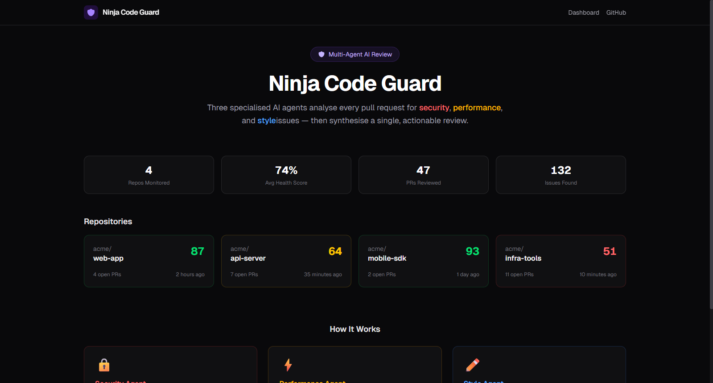
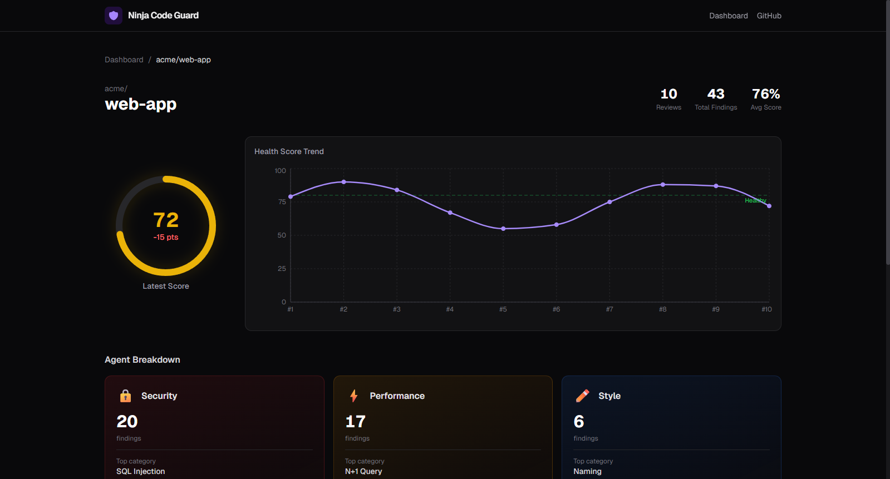

# Ninja Code Guard

**Multi-agent code review system that reviews GitHub pull requests the way a senior engineering team would.**

Three specialized AI agents — Security, Performance, and Style — analyze your code in parallel, then a Synthesizer merges their findings into a single, prioritized, non-overlapping review with inline GitHub comments.

## Screenshots

### PR Review — Bot posts inline findings with Health Score


### Dashboard — Repository overview with health metrics


### Repo Detail — Health Score trend, agent breakdown, PR history


### PR Detail — Agent breakdown and findings table


## How It Works

```
PR opened on GitHub
        │
        ▼
   Webhook received ──→ HMAC-SHA256 validated
        │
        ▼
   Redis cache check ──→ Skip if already reviewed
        │
        ▼
   Fetch PR data ──→ Diff + full file contents
        │
        ▼
   RAG Context ──→ Embed files → ChromaDB → Retrieve related code
        │
        ▼
   ┌─────────────────────────────────────────┐
   │     3 Agents run IN PARALLEL            │
   │  🔒 Security  ⚡ Performance  ✏️ Style  │
   │  Bandit+LLM    Radon+LLM     Ruff+LLM  │
   └─────────────┬───────────────────────────┘
                 │
                 ▼
   Synthesizer ──→ Deduplicate → Rank → Score → Summarize
        │
        ▼
   Post to GitHub ──→ Inline comments + Summary with Health Score
```

## What Each Agent Does

| Agent | Focus | Static Tools | Example Findings |
|-------|-------|-------------|------------------|
| 🔒 **Security** | Vulnerabilities, auth, secrets | Bandit, detect-secrets | SQL injection, hardcoded API keys, weak crypto |
| ⚡ **Performance** | Efficiency, scalability | Radon complexity | N+1 queries, O(n²) loops, blocking I/O |
| ✏️ **Style** | Readability, maintainability | Ruff linter | Unused imports, bad naming, dead code |
| 🧠 **Synthesizer** | Merge & prioritize | — | Deduplication, conflict resolution, Health Score |

## Tech Stack

| Layer | Technology | Why |
|-------|-----------|-----|
| LLM | Groq (Llama-3.3-70B) | 500+ tokens/sec, free 14.4K req/day |
| Agents | LangChain + Structured Output | Typed JSON responses, prompt templates |
| Backend | FastAPI on Render | Async, auto OpenAPI docs, free tier |
| Vector DB | ChromaDB + sentence-transformers | RAG context, semantic code search |
| Cache | Upstash Redis | Prevent duplicate reviews |
| Database | Neon Postgres | Review history, Health Score trends |
| Dashboard | Next.js on Vercel | Review history, trend charts |
| GitHub | GitHub App (webhooks) | Inline PR comments, bot identity |

## Quick Start

### Prerequisites
- Python 3.11+
- Groq API key (free at console.groq.com)
- GitHub App (registered at github.com/settings/apps)

### Setup

```bash
# Clone and setup
git clone https://github.com/ninjacode911/ninja-code-guard
cd ninja-code-guard
python -m venv .venv && source .venv/bin/activate  # Windows: .venv\Scripts\activate
pip install -r requirements.txt

# Configure
cp .env.example .env
# Edit .env with your API keys

# Run
uvicorn app.main:app --reload --port 8000
```

### Environment Variables

```env
GROQ_API_KEY=gsk_...
GITHUB_APP_ID=123456
GITHUB_APP_PRIVATE_KEY_PATH=./keys/app.pem
GITHUB_WEBHOOK_SECRET=...
DATABASE_URL=postgresql://...
UPSTASH_REDIS_URL=rediss://...
```

## Architecture

**4 Layers:**
- **GitHub Layer** — Webhooks, PR events, inline comments
- **Orchestration Layer** — FastAPI, agent dispatch, asyncio.gather
- **Agent Layer** — 3 domain agents + synthesizer (LangChain ReAct)
- **Knowledge Layer** — ChromaDB (RAG), Redis (cache), Postgres (history)

**Key Design Patterns:**
- Template Method — All agents share a base class, override only prompt + tools
- Structured Output — LLM constrained to return valid JSON (Pydantic schema)
- Fail-Open Cache — If Redis is down, proceed with analysis
- Background Tasks — Return 200 to GitHub immediately, review asynchronously
- Parallel Execution — asyncio.gather runs 3 agents concurrently

## Test Results

```
PR #4 on codeguard-test repo:
  Security:    5 findings  (SQL injection, weak crypto, hardcoded secrets)
  Performance: 3 findings  (O(n²) loop, blocking I/O, high complexity)
  Style:       6 findings  (unused imports, magic numbers, bad naming)
  Total:       14 findings
  Health Score: 14/100
  Latency:     ~13 seconds (after model load)
```

## Running Tests

```bash
pytest tests/unit/ -v
```

## Project Structure

```
app/
  agents/          # Security, Performance, Style, Synthesizer
  tools/           # Bandit, detect-secrets, Radon, Ruff wrappers
  context/         # RAG pipeline (embedder, indexer, retriever)
  github/          # Webhook validation, API client, comment formatter
  models/          # Pydantic schemas (Finding, SynthesizedReview)
  db/              # Redis cache, Postgres queries
  services/        # Health Score calculator
dashboard/         # Next.js frontend (Vercel)
tests/             # Unit tests + evaluation harness
prompts/           # Agent system prompts (Markdown)
docs/              # Week-by-week documentation
```

## Documentation

Detailed week-by-week documentation available in `docs/`:
- [Week 1: Foundation & Setup](docs/WEEK1_FOUNDATION_AND_SETUP.md)
- [Week 2: GitHub Integration](docs/WEEK2_GITHUB_INTEGRATION.md)
- [Week 3: Security Agent](docs/WEEK3_SECURITY_AGENT.md)
- [Week 4: Performance Agent](docs/WEEK4_PERFORMANCE_AGENT.md)
- [Week 5: Style Agent](docs/WEEK5_STYLE_AGENT.md)
- [Week 6: RAG & Parallel Execution](docs/WEEK6_RAG_AND_PARALLEL.md)

## License

MIT

---

Built by [ninjacode911](https://github.com/ninjacode911)
